# Práctica 3.2 - Despliegue con Node Express y con Netlify

## Despliegue con Node Express

En primer lugar debemos asegurarnos de que Tomcat no está ejecutándose: 

```console
sudo systemctl status tomcat9	# Comprobar el estado de Tomcat
sudo systemctl stop tomcat9	# Parar Tomcat
```

A continuación instalamos Node.js y el gestor de paquetes npm:

```console
sudo apt install nodejs npm
```

Para realizar el despliegue, clonamos un repositorio de GitHub que contenga 
una aplicación Node. Nos colocamos dentro del directorio del proyecto e 
instalamos los paquetes requeridos ejecutando: 

```console
npm install
```

También es importante comprobar en el código fuente de la aplicación el puerto 
que utilizará para comunicarse. En mi caso es el puerto 3000, por lo que ejecuto: 

```console
sudo ufw allow 3000/tcp
```
Si tratamos de desplegar la aplicación, aparecerá el mensaje de error "nodemon: 
not found". Para solventar este problema, agregamos dicho paquete al archivo 
package.json ejecutando:

```console
npm install nodemon --save-dev
```

Y ahora podremos desplegar la aplicación correctamente con: 

```console
npm run start
```

Y podremos acceder a ella desde el navegador de nuestra máquina anfitriona indicando 
la IP de nuestra máquina virtual y el puerto en el que se aloja la aplicación (en 
mi caso, el 3000):

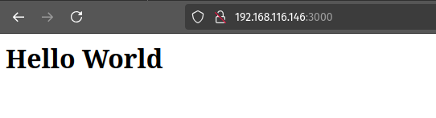


## Cuestiones sobre Node Express


## Despliegue con Netlify

En primer lugar, preparamos una aplicación simple consistente de dos archivos HTML y un
JS e inicializamos el proyecto con:

```console
npm init
```

Y podemos comprobar en local que funciona correctamente con:

```console
node aplicacion.js
```

Y accediendo desde el navegador a la IP y puerto de la aplicación (debemos asegurarnos de 
que Tomcat u otras aplicaciones no están utilizando ya ese puerto):

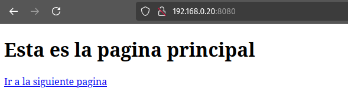

Alternativamente, también podemos comprobarlo con curl:

```console
curl 192.168.0.20:8080
```

Para poder desplegar sin problemas la aplicación, debemos modificar el archivo 
'package.json'. En concreto, hay que modificar el bloque 'scripts' dentro de este 
archivo para que quede de la siguiente manera:

```console
"scripts": {
	"start":"node aplicacion.js"
}
```

Teniendo en cuenta todas estas cuestiones, borramos esta aplicación simple y clonamos 
un repositorio de GitHub que contiene una aplicación de ejemplo que sí desplegaremos con 
Netlify.

Utilizaremos dos métodos para desplegar aplicaciones con Netlify: el despliegue manual 
desde el CLI (Command Line Interface) y el despliegue desde el código publicado en 
GitHub.

Antes de empezar con el despliegue, es necesario registrarse en Netlify. En mi caso, me 
registro con mi cuenta de correo, para que no se enlace mi cuenta de GitHub directamente. 

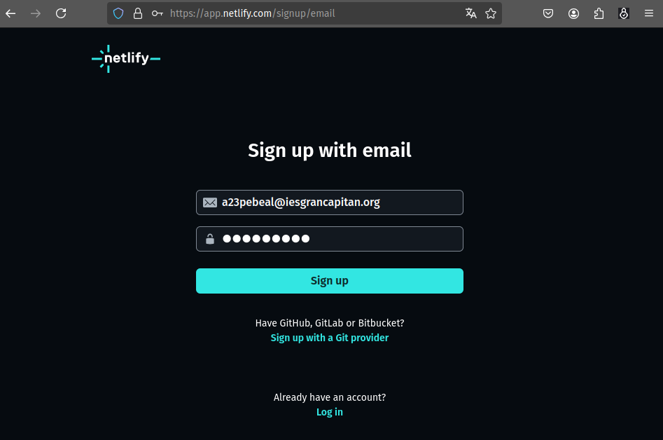

Netlify envía un email de confirmación, que nos reenvía a su página donde debemos 
responder a una serie de preguntas sobre nosotros (nombre, si pertenecemos a alguna 
institución o empresa, etc) donde lo único relevante es que he saltado el paso de 
enlace con GitHub, que realizaré más adelante. A continuación, pasamos a los procesos 
del despliegue en sí.

### Despliegue mediante Interfaz de Línea de Comandos

En primer lugar, será necesario generar un token de acceso personal para que podamos 
establecer una conexión segura con Netlify. Para ello, desde la página web, accedemos 
a las 'users settings' y clicamos en 'Applications'. Desde ahí podremos seleccionar 
'New access token' y se generará un nuevo token, que es una cadena de texto que 
debemos copiar y guardar.

Volviendo al terminal (conectado por SSH a nuestro servidor), debemos definir una 
variable de entorno que contenga el token generado por Netlify:

```console
export NETLIFY_AUTH_TOKEN={token_generado_por_netlify}
```

Ahora ya podemos instalar el CLI de Netlify: 

```console
sudo npm install netlify-cli -g
```

Y si tratamos de ejecutar 'netlify login', nos dirá que ya estamos loggeados porque ya 
se ha comprobado el contenido de la variable de entorno 'NETLIFY_AUTH_TOKEN'.

Este es el momento de instalar las dependencias de la aplicación, buildearla y 
desplegarla. Nos colocamos dentro del directorio de la aplicación y ejecutamos:

```console
sudo npm install
sudo npm run build
netlify deploy
```

Le indicamos que queremos crear un nuevo sitio y respondemos las preguntas que nos 
netlify nos plantea. En mi caso: 

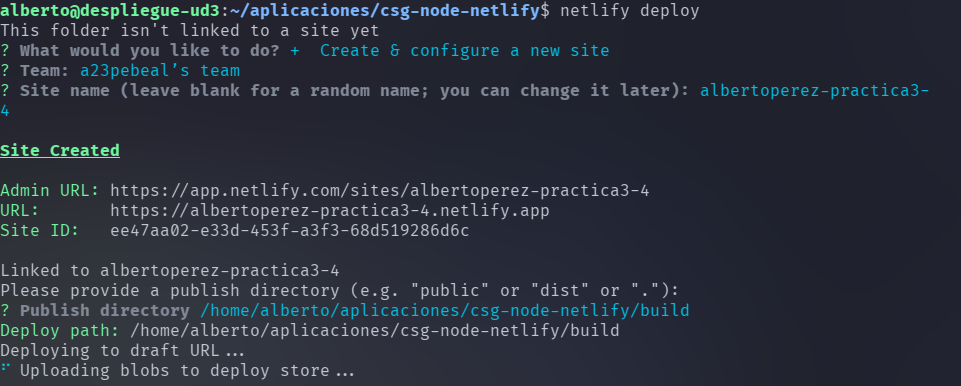

Esa es la fase de "pre-deploy". Para llevar la aplicación al despliegue definitivo, 
ejecutamos:

```console
netlify deploy --prod
```

Y le indicamos el directorio con el contenido a desplegar. En mi caso, './build' desde 
el directorio de la aplicación. Para comprobar que el despliegue ha resultado exitoso, 
accedo a la URL que indica Netlify:

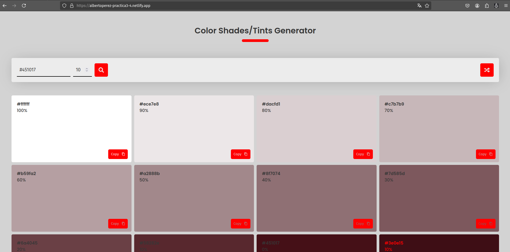

### Despliegue mediante conexión con GitHub

Para realizar el despliegue mediante una conexión entre Netlify y GitHub, en primer 
lugar, eliminamos desde la página de Netlify la página desplegada anteriormente 
(accedemos a la configuración del site y bajamos hasta encontrar la opción 'delete site') 
y en nuestra MV, eliminamos el directorio con el contenido de la aplicación.

Para simular un proyecto que hemos desarrollado desde cero y del que, en principio, 
sólo disponemos el código fuente en local, descargaremos el código fuente de la 
misma aplicación que usamos en el despliegue anterior en un archivo zip desde GitHub, 
crearemos un repositorio vacío y subiremos el código fuente de la aplicación. Para ello, 
ejecutamos:

```console
# Comandos para bajar el código fuente: 

mkdir practica3-4	# Creamos directorio para almacenar el código.
wget https://github.com/StackAbuse/color-shades-generator/archive/refs/heads/main.zip	# Descargamos el código fuente de la aplicación.
unzip main.zip -d practica3-4	# Descomprimimos el archivo con el código fuente en el directorio creado anteriormente.
cd practica3-4/color-shades-generator-main/	# Nos colocamos en el directorio que contiene el código fuente.
```

En este momento es conveniente tener creado el repositorio vacío en GitHub. Para ello, 
accedemos a la página y buscamos el botón de "Nuevo repositorio". En mi caso, mi 
repositorio remoto se llama 'practica3-4'. 

Además, es conveniente que creemos un par de claves pública-privada mediante SSH para 
comunicar nuestra MV con GitHub. Para ello:

```console
ssh-keygen -t ed25519 -C "a23pebeal@iesgrancapitan.org"
# Donde -t es una bandera que especifíca el algoritmo utilizado para generar las claves.
# Donde -C es un comentario que añadimos a la clave, yo he utilizado el correo electrónico que tengo asociado a mi cuenta de Github, como indica su guía para generar claves SSH.
```

A continuación, el comando nos presenta unas preguntas que dejaremos en blanco, de 
manera que las claves se almacenarán en el directorio por defecto '~/.ssh/' y no será 
necesario indicar ninguna frase de seguridad para acceder a las claves. Por último, 
añadimos la clave privada generada al manejador de claves:

```console
ssh-add ~/.ssh/id_ed25519
```

Momentáneamente dejamos el terminal, accedemos a nuestra cuenta de GitHub desde el 
navegador, nos dirigimos a 'Settings/SSH and GPG keys/' y pulsamos 'Nueva clave SSH'.
Debemos copiar y pegar el contenido de '~/.ssh/id_ed25519.pub' (que es nuestra clave 
pública) y subirlo dos veces, una como 'Authentication key' y otra como 'Signing key'.

Una vez creado el repositorio y configuradas las claves SSH, volvemos al terminal 
(que, recordamos, está conectado por SSH a la MV) y ejecutamos los siguientes comandos 
para inicializar el repositorio local y relacionarlo con el repositorio remoto: 

```console
# Comandos de git para crear el nuevo repositorio:
git init	# Inicializamos el repositorio
git branch -M main	# Indicamos que la rama principal será "main"
git remote add origin {dirección SSH del repositorio remoto}	# Indicamos la dirección SSH del repositorio remoto al que subiremos el código fuente de la aplicación.

git add .	# Añadimos el código fuente al 'stage' de git.
git commit -m "Subida del código fuente."	# 'Comprometemos' los archivos en el área de 'stage' y le añadimos un comentario descriptivo.
git push --set-upstream origin main	# Subimos el código al repositorio remoto, creando en él la rama 'main', que existe en local pero no aún en remoto. 
```

Este es el aspecto que tendrá ahora nuestro repositorio remoto en GitHub:

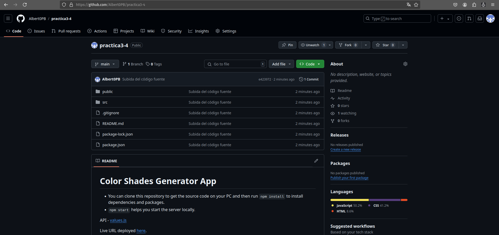

Con el código subido al repositorio remoto, ya sólo queda enlazar nuestra cuenta de 
GitHub con Netlify. Para ello, volvemos al navegador y entramos a Netlify y seleccionamos 
"Import from Git" e indicamos GitHub como nuestro proveedor. Nos saltará una ventana 
emergente de GitHub preguntándonos si queremos ceder a Netlify permisos para consultar 
información de nuestra cuenta y realizar determinadas acciones: 

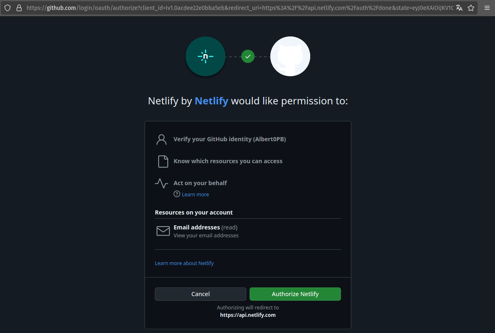

Confirmamos la autorización y se nos llevará a otra página (en la misma ventana) 
preguntándonos esta vez dónde queremos "instalar Netlify". Se nos presentará una lista 
de las organizaciones que tenemos asociadas en GitHub, encabezada por nuestro usuario:

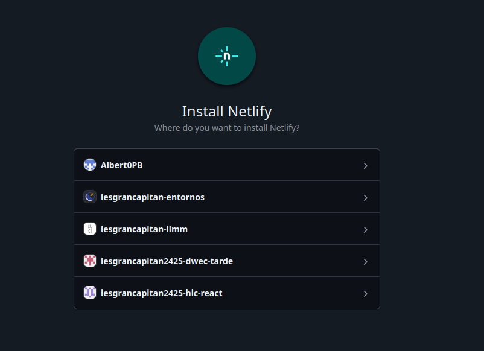

Seleccionamos nuestro usuario y se nos presentará la opción de instalar Netlify en todos 
nuestros repositorios o en sólo una selección de estos. En este caso, indicaremos sólo 
el repositorio 'practica3-4' y procedemos a la instalación de Netlify:

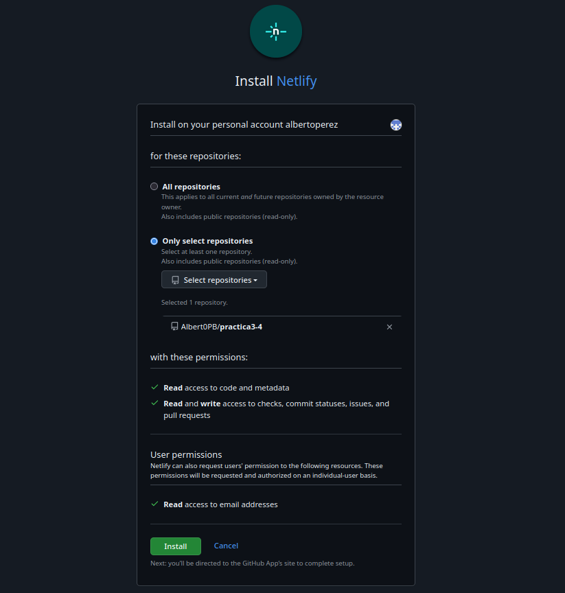

Ahora se cerrará la ventana emergente y volvemos a la ventana original de Netlify en 
la que estábamos originalmente realizando el enlace a GitHub. Podemos ver que ahora 
nos aparece el repositorio que hemos seleccionado para que se instale Netlify:

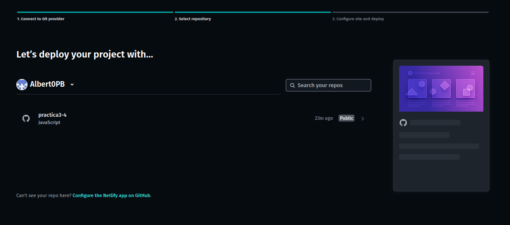

Lo seleccionamos y llegaremos a la página de deploy, que nos ofrece una serie de 
opciones para el despliegue. En principio, sólo es necesario indicar el nombre del 
'site' (es conveniente comprobar la disponibilidad antes de intentar desplegarlo) 
y podemos dejar el resto de opciones que aparecen predeterminadas:

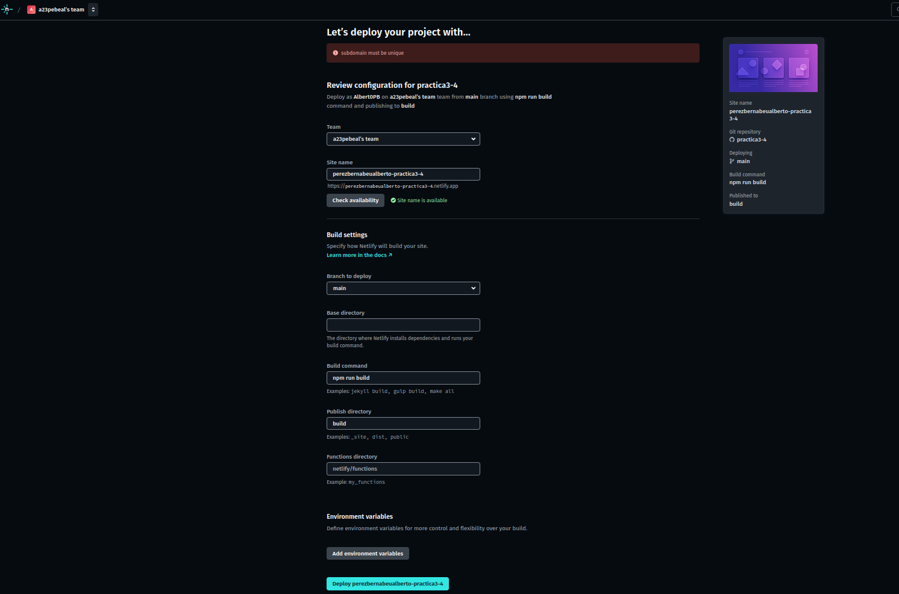

Netlify tardará un poco en realizar el despliegue. Cuando haya terminado, saltará un 
mensaje de la página notificándonos que ha finalizado y podremos acceder a la 
aplicación desplegada:

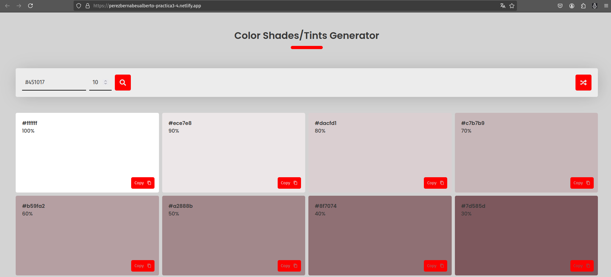

Ahora, todos los cambios que realicemos sobre el código y que subamos a GitHub, se 
realizarán también sobre la aplicación desplegada en Netlify. Para comprobarlo, 
vamos a modificar el archivo ubicado en '/ruta_aplicacion/public/robots.txt'. 
Primero, comprobamos su contenido directamente desde el navegador: 

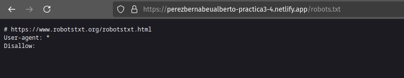

Modifico el contenido en local:

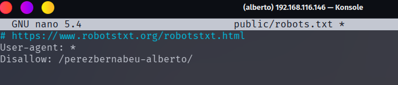

Y ejecuto los siguientes comandos de git para subir los cambios a GitHub:

```console
git add .
git commit -m "Modificación robótica"
git push
```

Si recargamos el navegador, podremos ver el recurso con el contenido actualizado: 


Es decir que al desplegar la aplicación mediante la vinculación de GitHub con una 

## Despliegue con Vercel

Para realizar el despliegue con Vercel, creamos una cuenta también con nuestro correo 
electrónico (realizaremos el "enlace con GitHub más adelante). Una vez en la página 
principal de Vercel, se nos presentan varias opciones de proveedores git y escogemos 
GitHub. Al igual que con Netlify, se nos abre una nueva ventana de GitHub que nos pide 
autorizar a Vercel a consultar datos y a realizar acciones sobre GitHub en nombre 
nuestro:

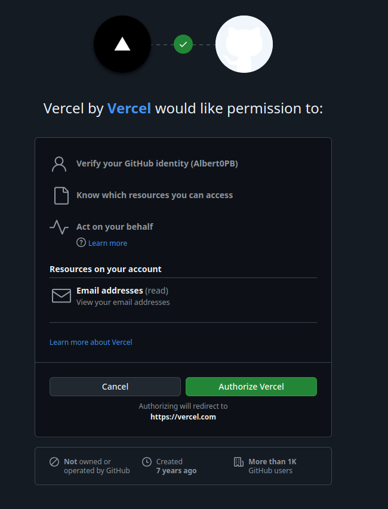

Se cerrará la ventana y ahora la página de Vercel habrá cambiado, mostrando la opción 
para importar un repositorio de GitHub al que instalar la aplicación de Vercel:

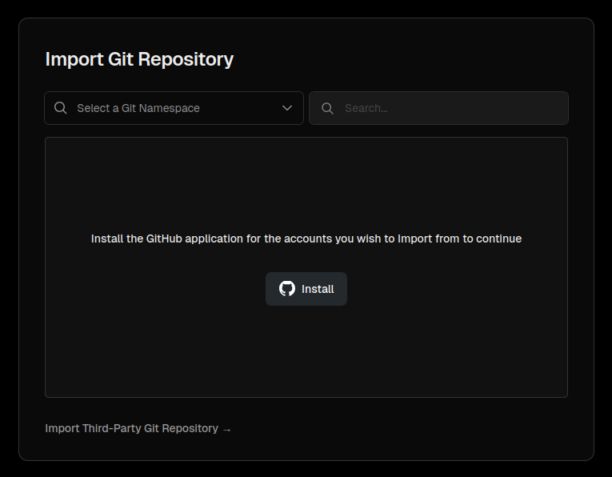

Clicamos en "Install" y se volverá a abrir otra ventana de GitHub, donde tendremos un 
menú con la lista de nuestras organizaciones, encabezada por nuestro usuario de GitHub, 
idéntica a la que se mostraba en Netlify:

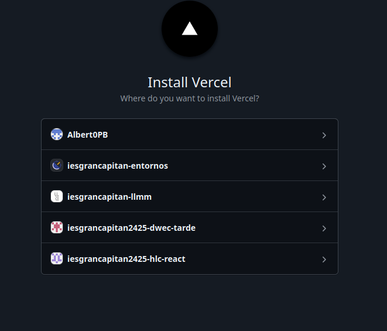

Selecciono mi usuario y de nuevo, podemos instalar la aplicación de Vercel en todos los 
repositorios o sólo en uno. Seleccionamos el repositorio 'practica3-4':

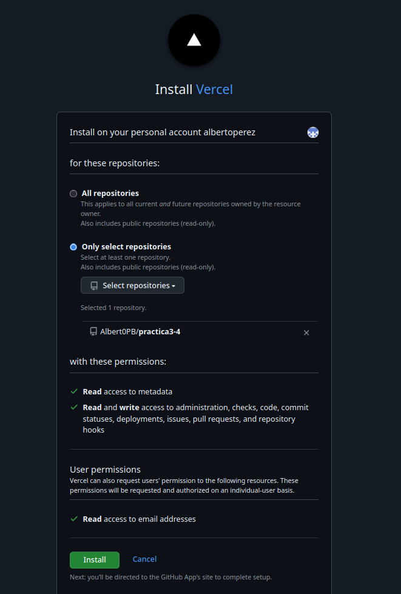

Se cierra la ventana y ahora en Vercel nos aparecerá el repositorio para importarlo:

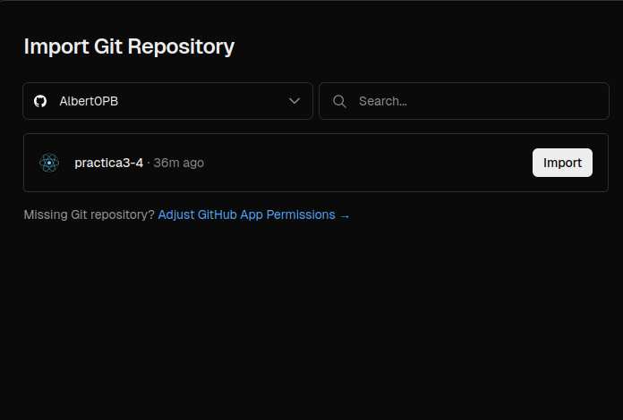

Clicamos en "Import" y se nos dirige a la página de despliegue:

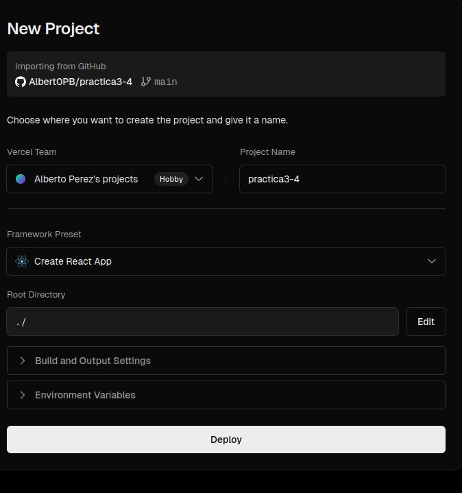

Vercel tardará unos momentos en realizar el despliegue y cuando termine nos lo 
notificará con un mensaje de celebración: 

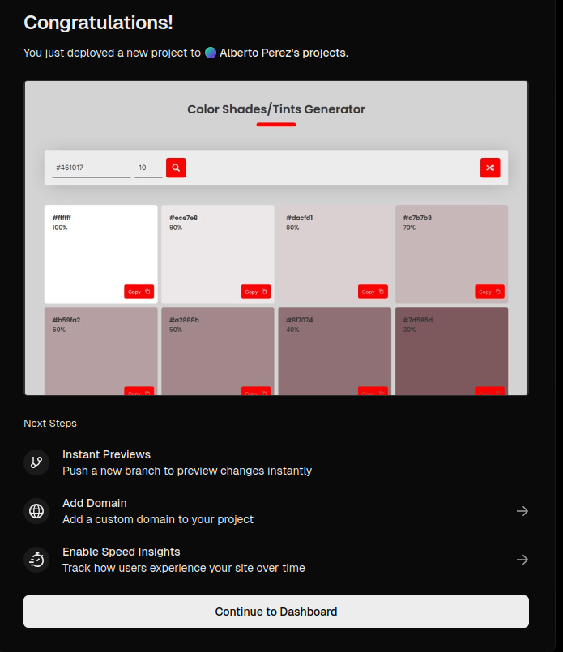

Y podremos acceder a la aplicación desplegada:

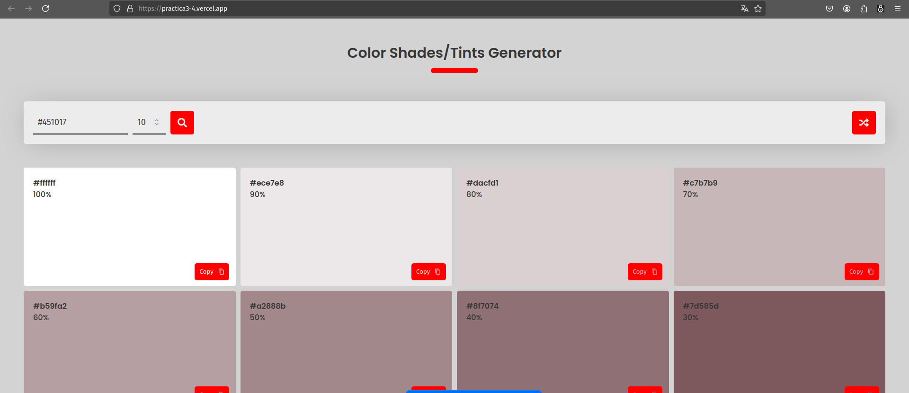

Volvemos a modificar localmente el archivo '/public/robots.txt':

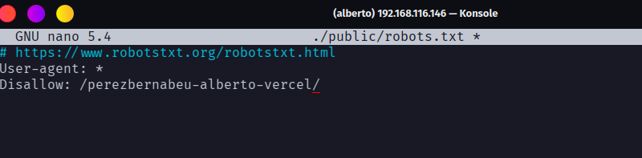

Subimos los cambios al repositorio remoto y recargamos la aplicación desplegada en 
Vercel:

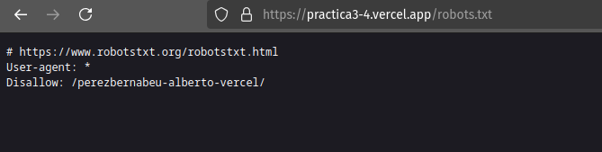
